# Dosed Lens

**A client-side perception simulator.** Load a photo, pick one of twelve substances, set an intensity, and the canvas renders the image as if the *camera itself* were the altered observer — animated in real time, exportable as a PNG frame or a short WebM.

It is a perception-simulation art/education tool. **All processing happens in your browser — images never leave your device.** Intensity is expressed in phenomenology-literature *tiers*, never doses. There is no consumption, sourcing, or dosing content anywhere in the project.

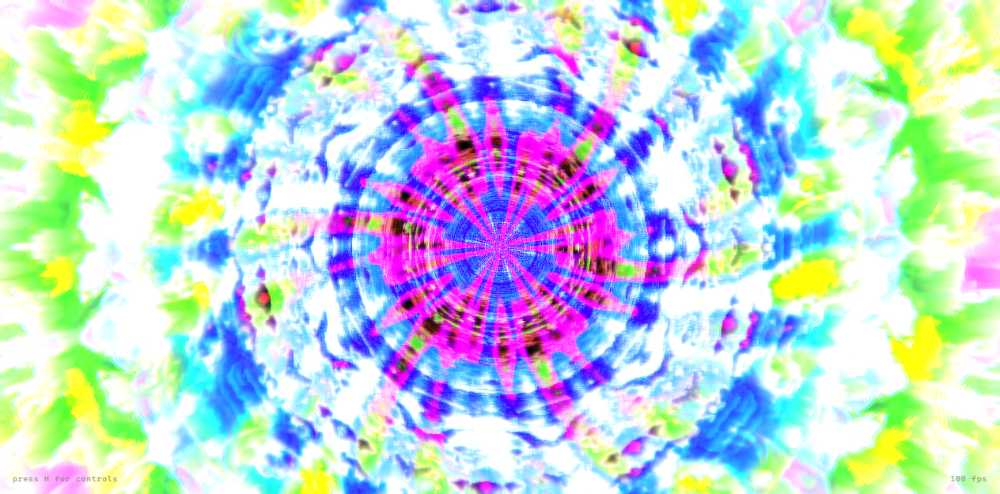

---

## Showcase

Each render is driven by the image's *own* structure — edges, luminance, texture frequency — so walls breathe along their own contours, halos grow from real light sources, and patterns crawl along the surfaces they live on. The goal: each substance is identifiable *blind*.

| | | |
|:---:|:---:|:---:|
| 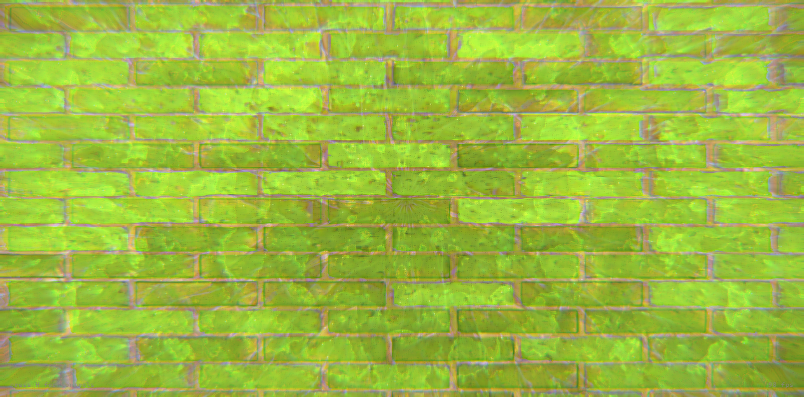<br>**LSD** — fractal lattice folding | 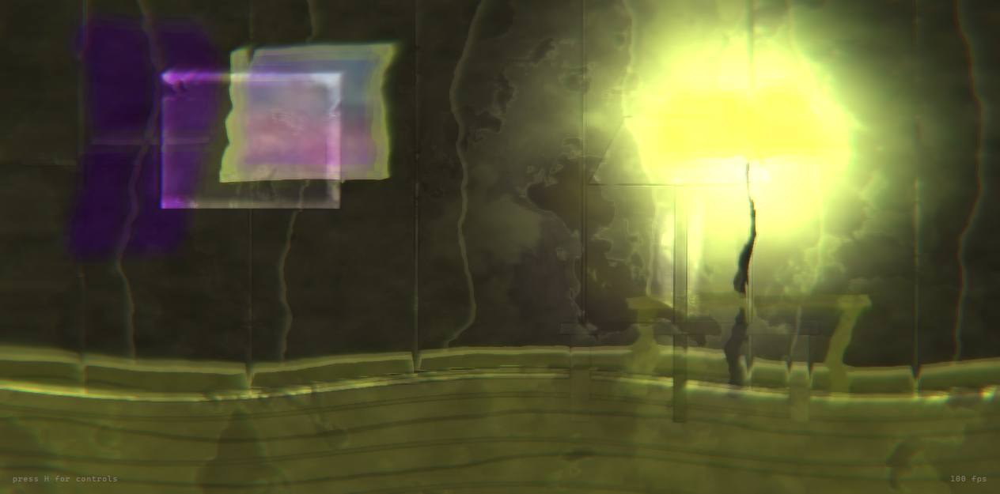<br>**Psilocybin** — molten wet paint | <br>**DMT** — breakthrough tunnel |
| 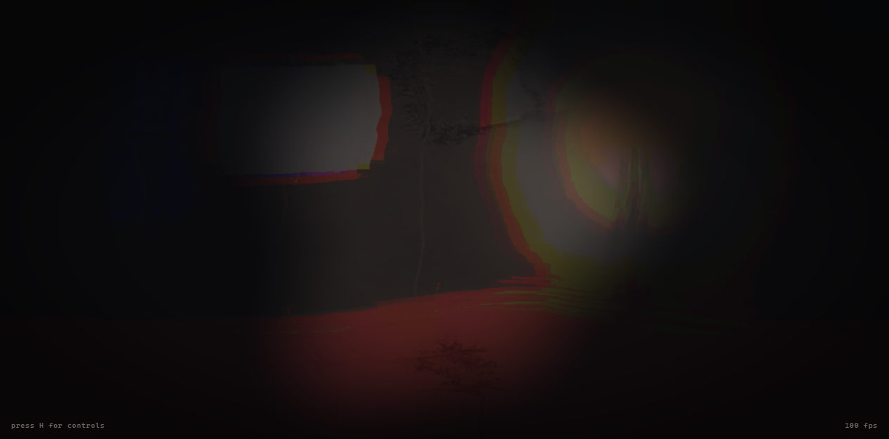<br>**Ketamine** — cubist flat painting | 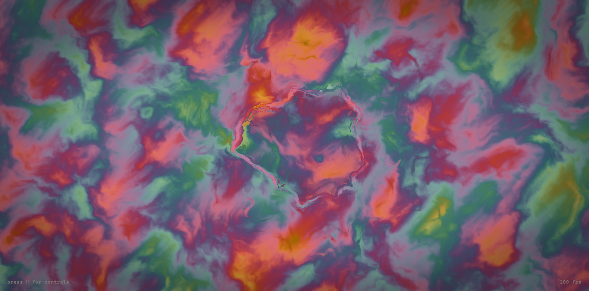<br>**Salvia** — reality re-tiling | 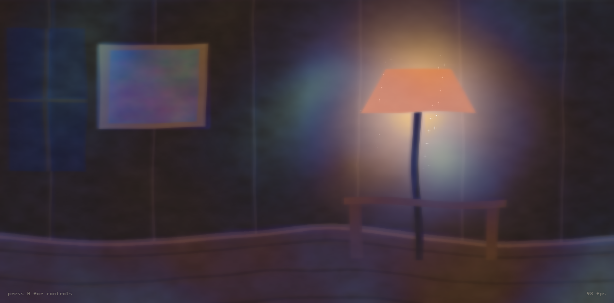<br>**Nitrous** — throbbing waves |
| 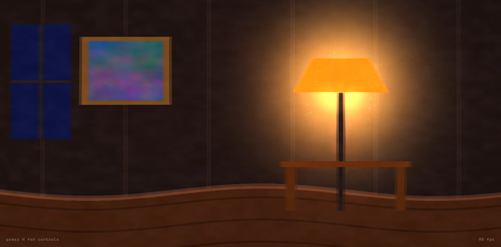<br>**MDMA** — starbursts & shimmer | 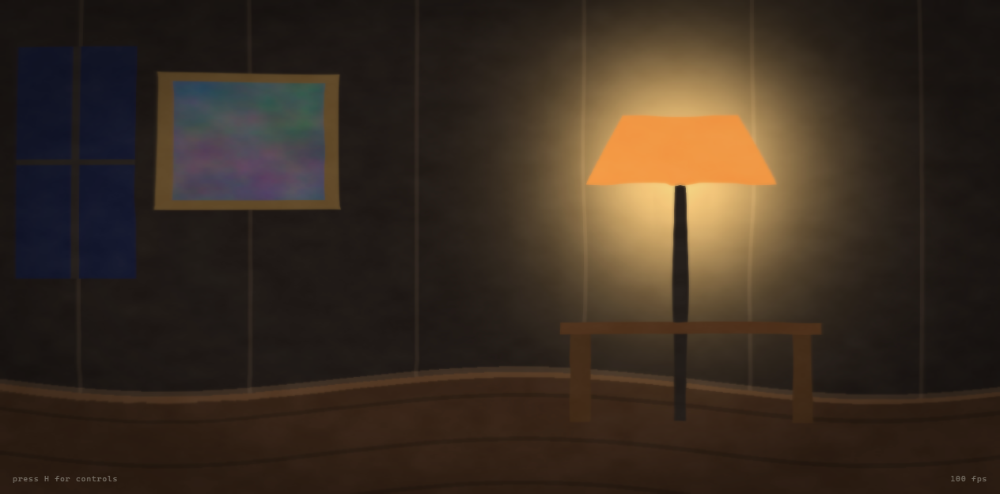<br>**Cannabis** — halos & lag | 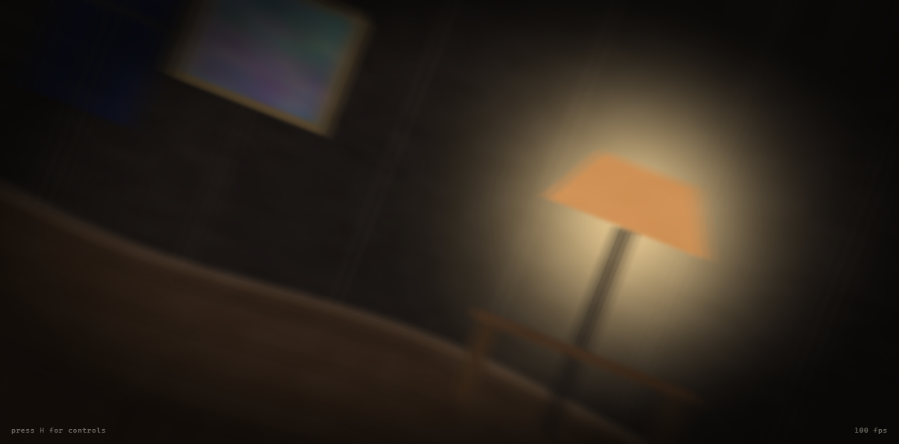<br>**Alcohol** — diplopia & spins |
| 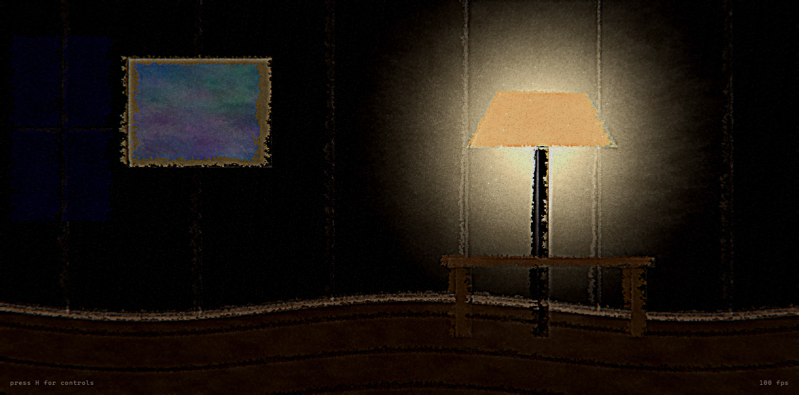<br>**Meth** — snow & corner shadows | 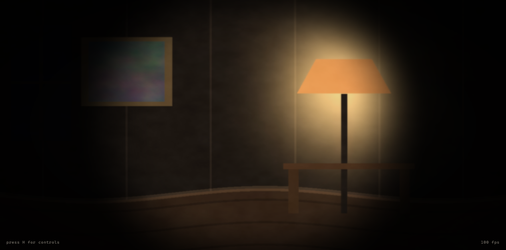<br>**Opioid** — golden pinhole nod | 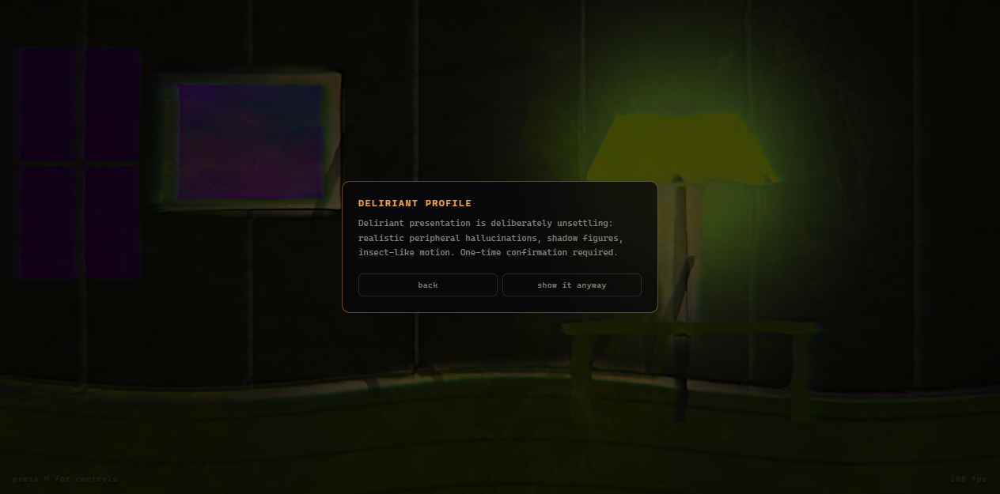<br>**DPH** — deliriant wrongness |

---

## The twelve substances

Chosen for maximum visual distinctiveness across drug classes. Each simulation is grounded in [PsychonautWiki](https://psychonautwiki.org/)'s subjective-effect reports (cited per profile in `src/profiles/*.json` under `sources`).

| Class | Substance | Signature look |
|---|---|---|
| Psychedelic | **LSD** | Sharper-than-real; geometry living in textures; recursive fractal folding + rainbow trails at Heavy |
| Psychedelic | **Psilocybin** | Slow organic breathing; surfaces melt and flow like wet paint; olive/amber earth tones |
| Psychedelic | **DMT** | Instant crystalline geometry; at Heavy the scene dissolves into a kaleidoscopic tunnel |
| Dissociative | **Ketamine** | Depth flattens into a cubist painting; vertical double vision; k-hole recedes into darkness |
| Dissociative | **Nitrous oxide** | Rhythmic wah-wah throb; frame echo/flange; a soft wall of interlocking-circle geometry |
| Atypical | **Salvia divinorum** | Reality shears into repeating tiles; lateral pull; a cartoon-flat "other place" at Heavy |
| Entactogen | **MDMA** | Lights bloom into starbursts; episodic eye-wiggle; magenta warmth and shimmer |
| Cannabinoid | **Cannabis** | Subtle: halos, motion lag, time hiccups, peripheral breathing (the realism floor) |
| Depressant | **Alcohol** | Progressive double vision, pan-lag smear, horizon sway; the spins at Heavy |
| Stimulant | **Methamphetamine** | Over-sharpened vigilant vision; visual snow; shadows in the corners that flee your gaze |
| Deliriant | **Diphenhydramine** ⚠ | Not colorful — *wrong*: sickly cast, skittering specks, shadow figures, blur waves |
| Opioid | **Opioids** | Warm golden pinhole; the "nod" cycle sinks vision into darkness and snaps back |

Intensity runs on a continuous slider across five tiers: **Threshold · Light · Common · Strong · Heavy**. Threshold is barely perceptible; Heavy degrades in each substance's *own* way, not "the same effect, louder."

---

## Running it

Requires Node 18+. Zero runtime dependencies (Vite + vanilla TypeScript + WebGL2).

```bash
npm install
npm run dev        # http://localhost:5173
```

```bash
npm run build      # type-check + production bundle to dist/
npm run preview    # serve the production build
npm run samples    # regenerate the procedural sample images
```

---

## Controls

| Input | Action |
|---|---|
| `H` | Toggle the control panel |
| `Space` | Pause / resume |
| `1`–`5` | Jump to a tier (Threshold → Heavy) |
| Drag & drop | Load any image (or use the sample thumbnails / **load image**) |
| **split** | Before/after divider — drag it across the canvas |
| **png** / **rec** | Export the current frame, or record a WebM (auto-stops at 30 s) |
| Search box | Filter the substance picker |
| **per-effect overrides** | Multiply any active effect 0–2× to taste |

The full state lives in the URL hash, so any look is a shareable permalink:
`#s=lsd&i=0.6&img=02-brick-wall&o=breathing:1.5,tracers:0`

---

## How it works

The renderer is a fixed graph of eight full-screen passes. **P1 (analysis)** runs only when the image or resolution changes — it caches a Sobel edge field and a luminance mip pyramid that every downstream pass reads, so distortions are anchored to the photo's real structure. The rest run every frame:

```
P1 analysis → P2 geometry → P3 pattern → P4 color →
P5 temporal → P6 acuity → P7 grain → P8 post
```

Shared passes give the family resemblance; **signature modules give each substance its identity.** Each substance is one GLSL file (`src/signatures/*.glsl`) implementing three hooks — `sigWarp` (geometry), `sigColor` (color/overlay), `sigTemporal` (time domain) — that are `#include`-injected into P2/P4/P5 and recompiled on substance switch.

A **resolver** (`src/engine/`) turns `profile × intensity × response-curve × overrides` into the per-frame uniform block. The response curves (`early` / `smooth` / `late` / `spike` / `none`) are what make tiers feel *qualitatively* different: a `late` effect stays invisible until Strong, while an `early` one carries Threshold. A small CPU **particle layer** provides the meth corner-shadows and DPH skitter/smoke/figures.

Profiles are declarative JSON (`src/profiles/*.json`): shared-param curves and ceilings, per-signature parameters, phenomenology `tierNotes`, and `sources`.

### Performance

Targets 60 fps at 1080p on integrated graphics. Levers: P1 is cached, the pattern/grain passes run at reduced resolution, the particle cap is 200, the history ring is quarter-res, and all uniforms are written in one block with no per-frame allocations in the loop.

---

## Accessibility & safety

- **Photosensitivity:** profiles that use rhythmic pulsing or flicker (nitrous, meth, DMT, salvia) surface a photosensitivity note.
- **Reduced motion:** with `prefers-reduced-motion: reduce`, the app starts paused on a static processed frame.
- **Deliriant gate:** the diphenhydramine profile is deliberately unsettling (realistic peripheral hallucinations) and is gated behind a one-time confirmation.

---

## Samples & license

The six sample images are CC0 procedural renders generated by `scripts/gen-samples.mjs`. Reference material for the ported pattern/feedback math lives in `ref/`.

**Disclaimer:** Dosed Lens is a simulation of *perception*, grounded in published subjective-effect reports. It is an art and education tool. It contains no dosing, sourcing, or consumption guidance of any kind, and the tier vocabulary deliberately avoids numeric doses.

Built with [Claude Code](https://claude.com/claude-code).
